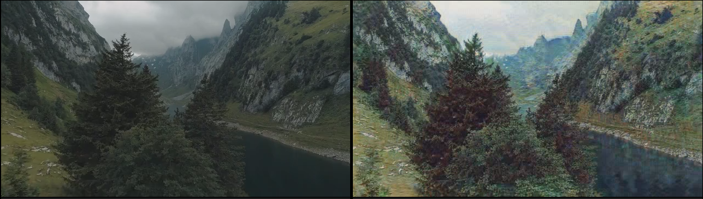

# CycleGAN
## Introduction
这是一个对CycleGAN的复现，一方面用于对于GAN系列的学习，另一方面学习使用Lightning。开始综合手头资源和兴趣考虑选择了CycleGAN，但最终仍然受限于资源没有得到满意的结果。
由于使用LightningCLI，我可以更方便的管理所有参数，并统一注入，实现了比原本利用字典记录yaml中内容然后各处读取更规范的方式，同时可以方便灵活的使用各种Lightning提供的工具。
在实验过程中由于如果按照论文要求使用256 &times; 256的输入，9个残差块，完整数据集会花费几天的时间；我将输入改成 128 &times; 128，相应的为6个残差块，使用25%的训练集，最终花费十几个小时。当然最后得到的效果也不尽如人意。可能是网络变小，输入小，训练少导致的网络能力问题，也有CycleGAN没有专门为处理视频设计的缘故。这是处理后的视频截图。

## Usage
配置文件放置在configs文件夹中，cg_fit.yaml是训练参数，cg_predict.yaml是预测参数，用于处理视频。
### environment
环境配置
```bash
# 安装 PyTorch（按官网选择你机器的 CUDA 版本）
# https://pytorch.org/get-started/locally/
conda env create -f docs/environment.yml -n cg
conda activate cg
pip install -r docs/requirements.txt
```
安装
```bash
pip install .
```
编辑模式
```bash
pip install -e .
```
### train
```bash
python src/cg/main.py fit --config configs/cg_fit.yaml
```
训练出来的checkpoints会保存在logs/cg中，
### predict
预测前修改cg_predict.yaml中的视频输入路径，同时先用utils中的vidinfo.py查看输入视频的参数进行修改。
因为过去Johnson的快速风格迁移和这个生成网络差不多，同时当时效果不错，我习惯于直接正向传播而不做缩小和放大的调整。但如果卡的性能不够，不要给分辨率太高的视频，会很慢。
```bash
python src/cg/main.py predict --config configs/cg_predict.yaml
```
训练出来的权重通过修改cg_predict.yaml中这个参数导入：
```yaml
ckpt_path: logs/cg/version_12/checkpoints/last.ckpt
```
## others
如果要修改网络成256 &times; 256， 需要将cg_predict.yaml中最后data部分
```yaml
size: 128
resize: 143
```

改成size
```yaml
size: 256
resize: 286
```
同时将src/cg/models/Generator.py的47行
```python
        self.resnetblocks = nn.Sequential(*(ResNetBlock(in_channels=256) for _ in range(6)))
```

改成
```python
        self.resnetblocks = nn.Sequential(*(ResNetBlock(in_channels=256) for _ in range(9)))
```
